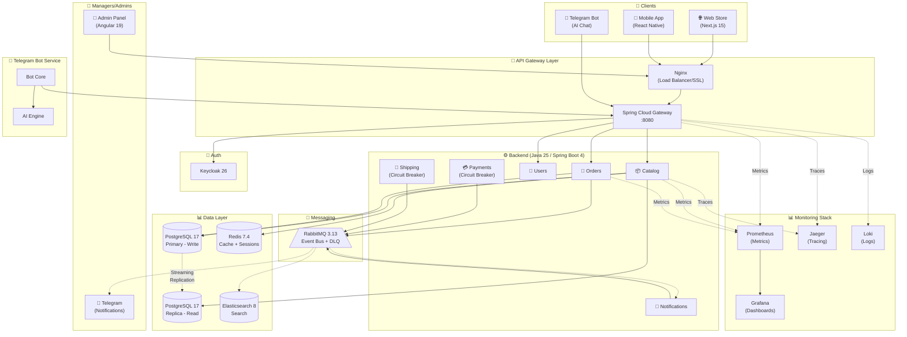
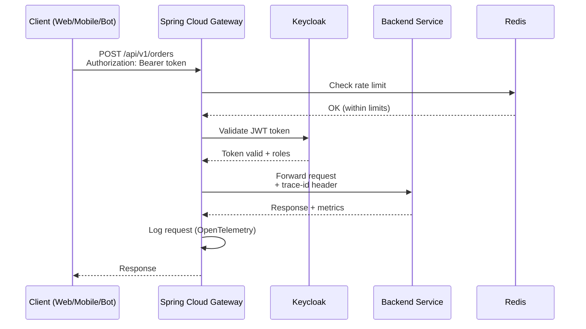
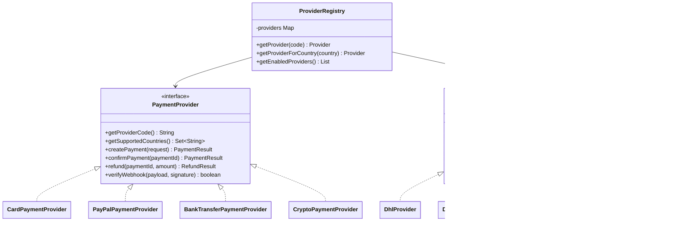
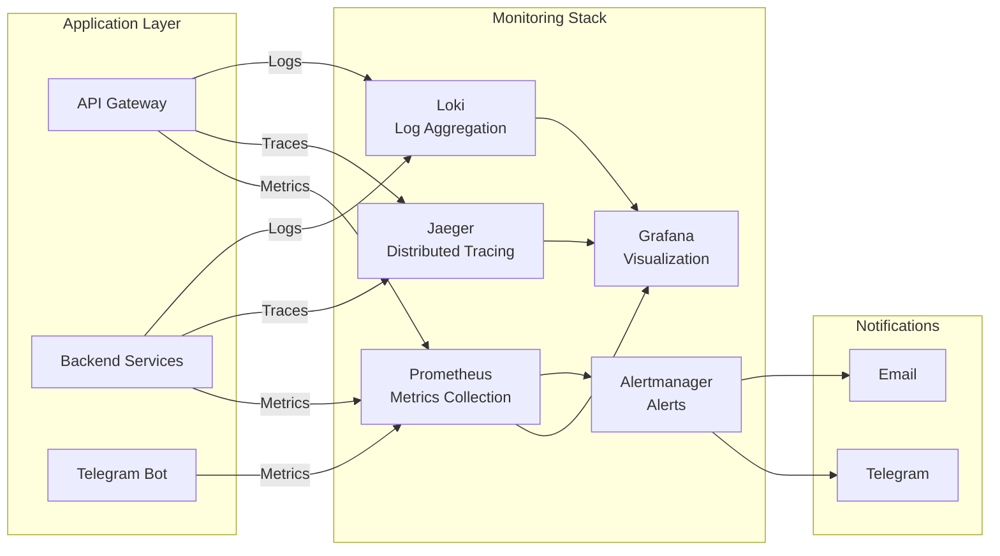
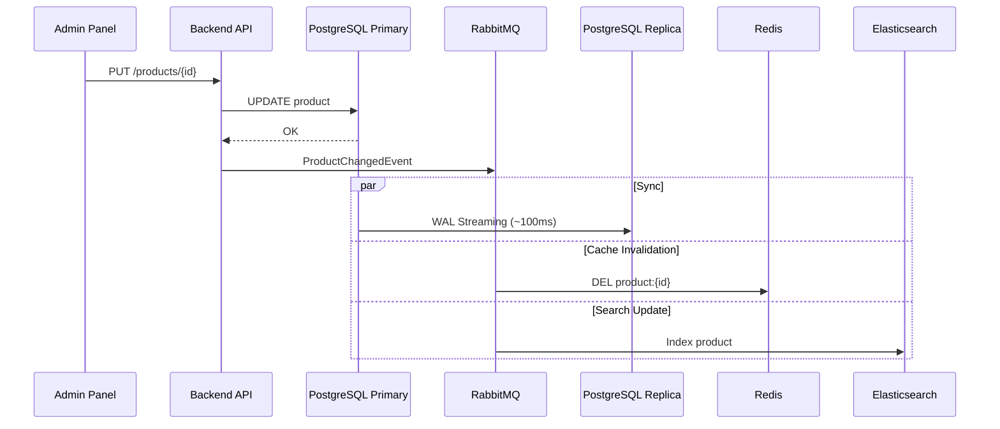

# 🏗️ Architecture Map

## High-Level Architecture



---

## 🚪 API Gateway Architecture

### Spring Cloud Gateway

**Role**: Single entry point for all clients with centralized routing, authentication, and monitoring.



**Features:**
- ✅ **JWT Validation** via Keycloak
- ✅ **Rate Limiting** (Redis-based)
- ✅ **Circuit Breaker** for backend services
- ✅ **Request/Response Transformation**
- ✅ **Load Balancing** between instances
- ✅ **Distributed Tracing** (OpenTelemetry)
- ✅ **Centralized Logging**

---

## 💳 Plugin Architecture: Payments & Shipping



Payment flow details: [payments-integration.md](payments-integration.md).

---

## 📊 Monitoring & Observability Stack

### Components
Note: Alertmanager is part of the production stack and is not included in the local docker-compose by default.



### Metrics (Prometheus + Grafana)

**System Metrics:**
- CPU, Memory, Disk usage
- Network I/O
- JVM heap, garbage collection

**Business Metrics:**
- Orders per minute
- Revenue per hour
- Payment success rate
- API response times (p50, p95, p99)
- Error rates

**Dashboards:**
1. **System Overview** - CPU, RAM, Disk
2. **API Performance** - Request rate, latency, errors
3. **Business Metrics** - Orders, revenue, conversion
4. **Database** - Query performance, connection pool
5. **Cache** - Hit rate, memory usage

### Distributed Tracing (OpenTelemetry + Jaeger)

```
TraceID: abc123...

Span: API Gateway [POST /api/v1/orders] - 150ms
  ├─ Span: Auth validation - 10ms
  ├─ Span: Rate limit check - 2ms
  └─ Span: Backend [OrderService.createOrder] - 130ms
      ├─ Span: DB [INSERT orders] - 15ms
      ├─ Span: DB [INSERT order_items] - 20ms
      ├─ Span: RabbitMQ [Publish event] - 5ms
      └─ Span: Redis [Cache update] - 3ms
```

### Log Aggregation (Loki)

**Structured Logging:**
```json
{
  "timestamp": "2026-01-23T12:34:56Z",
  "level": "INFO",
  "service": "backend-api",
  "traceId": "abc123...",
  "userId": "user_456",
  "message": "Order created",
  "orderId": "ord_789"
}
```

**Log Queries:**
```logql
# Errors in last hour
{service="backend-api"} |= "ERROR" | json

# Slow queries
{service="backend-api"} | json | duration > 1s

# Orders by user
{service="backend-api"} |= "Order created" | json | userId="user_456"
```

### Alerting (Alertmanager)

**Critical Alerts (Telegram + PagerDuty):**
- Service down (5 minutes)
- Error rate > 5%
- Response time p95 > 2s
- Database connection pool exhausted
- Payment provider unavailable

**Warning Alerts (Telegram):**
- CPU > 80% for 10 minutes
- Disk usage > 85%
- Low stock for products
- Failed RabbitMQ message > 10

---

## 📊 Database Replication



---

## 📁 Project Structure (Monorepo)

```
OnlineStore/
├── backend/                    # Java 25 Spring Boot 4
│   ├── common/
│   ├── catalog-module/
│   ├── orders-module/
│   ├── payments-module/        # Plugin providers
│   ├── shipping-module/        # Plugin providers
│   └── application/            # Main app
├── telegram-bot/               # Separate Spring Boot app
├── store-frontend/             # Next.js 15
├── admin-panel/                # Angular 19
├── mobile-app/                 # React Native
├── infrastructure/
│   ├── docker/
│   └── k8s/
└── docs/stages/                # Detailed plans
```

**Run:**
- Backend: single JAR (`java -jar backend.jar`)
- Frontend: separate dev servers / static builds
- Telegram Bot: separate JAR
